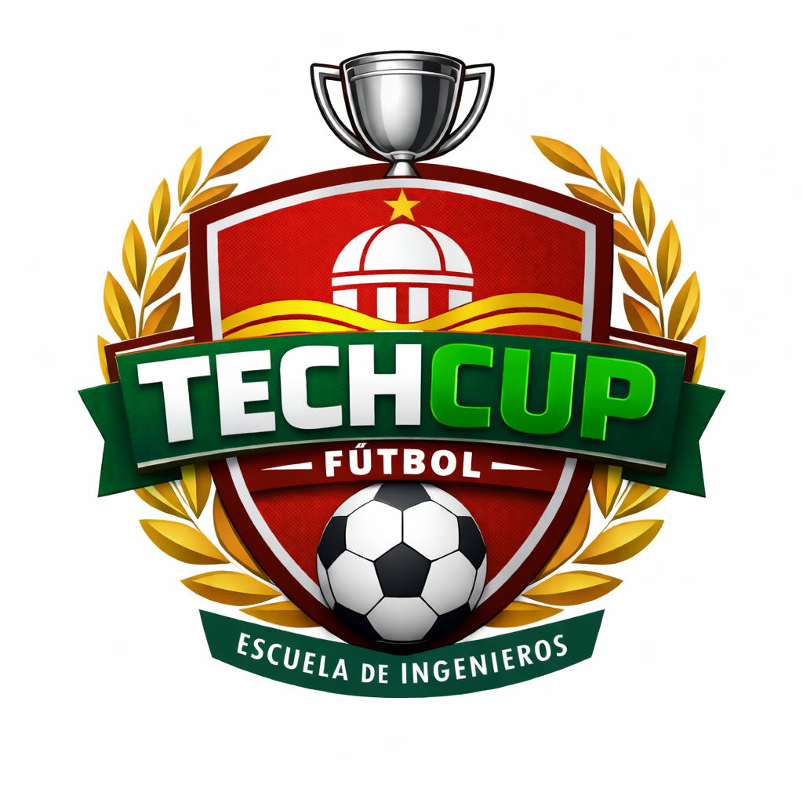

Cristian Adrian Ducuara Quiñonez
Cristian Ronaldo Guerrero Buitrago
Javier Mauricio Romero Deaquiz
Juan Esteban Tellez Valencia
Juan Sebastian Gonzalez Aranguren

## Contexto del proyecto 

- Esta aplicación surge para solucionar los problemas de organización del torneo relámpago de fútbol organizado por la 
Decanatura de Ingeniería de Sistemas de la Escuela Colombiana de Ingeniería. 
- Actualmente, la gestión del torneo se realiza de manera manual mediante mensajes en WhatsApp, formularios aislados y 
hojas de cálculo, lo que genera desorden en la información y dificulta el acceso a datos importantes para los 
participantes.
- La plataforma propuesta busca centralizar la información del torneo en un solo sistema, permitiendo gestionar de 
manera organizada aspectos como la inscripción de jugadores, la creación de equipos, el registro de partidos, la tabla 
de posiciones y las llaves eliminatorias, brindando así mayor claridad y facilidad de acceso a la información para 
todos los usuarios.

## Logotipo

## Manual de identidad

## Mockups

## Módulos de la aplicación

